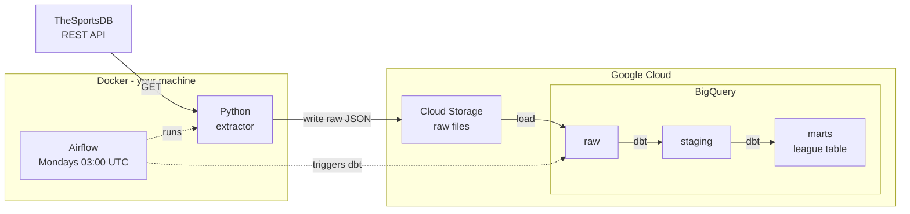

# Architecture

## Data flow

Solid arrows carry data. Dashed arrows are Airflow starting a step — no data moves along them.

## Pattern: ELT, not ETL

Raw API responses are stored permanently **before** any transformation. Cleaning
happens inside BigQuery using SQL.

**Why:** when transformation logic has a bug, the original data is still there.
Fix the SQL, re-run, done — no re-fetching from an API that may no longer serve
that history.

## Layers

| dbt name | Medallion | Contents | Rule |
|---|---|---|---|
| `raw` | 🥉 bronze | JSON as received; every field a string | Never edited |
| `staging` | 🥈 silver | Same grain, typed and renamed | Clean only, no joins |
| `marts` | 🥇 gold | Star schema + aggregates | Business-facing |

Data flows forward only. Marts never write back to staging.

## Tool choices

| Layer | Tool | Rejected alternative |
|---|---|---|
| Extract | Python + `requests` + `tenacity` | — |
| Landing | Google Cloud Storage | Direct-to-BigQuery: a failed load loses the payload |
| Warehouse | BigQuery | Postgres — OLTP engine, wrong shape for analytics scans |
| Transform | dbt | Python — forces a download, and forfeits free tests/docs/lineage |
| Orchestration | Airflow | cron — no retries, no observability, no ordered backfill |
| Packaging | Docker | Bare venv — environment drift between laptop and server |

## Boundaries

- **Docker** contains Python and Airflow — everything that runs on your machine.
- **Google Cloud** contains Cloud Storage and BigQuery — managed services.
- Airflow reaches *across* that boundary to trigger work; it never holds the data.

## Key design constraints

Driven by the findings in [requirements.md](requirements.md):

| Constraint | Architectural consequence |
|---|---|
| API caps results at ~5 rows/call | Fan out across league × season → Airflow dynamic task mapping |
| No server-side incremental filter | Watermarks maintained on our side |
| Current season mutates as fixtures play | Load with `MERGE` on `idEvent`, never `APPEND` |
| Undocumented rate limits | Client-side throttle + exponential backoff |
